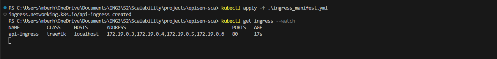
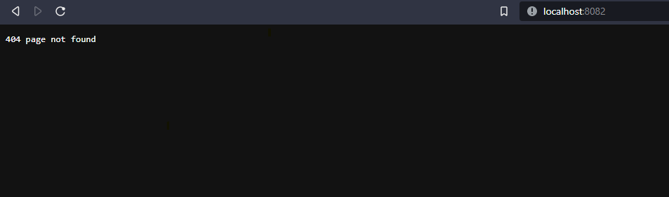

K8S for Deployment

I took the excisting NodeJs application and tried to deploy it using K8S 

## App Docker Image
Push Image to registry

```bash
docker build -t mabepisen/prod:v1 -f .
```


Check the image on DockerHub


## Kubernetes (K8s)
### Install a multi-node cluster
I used **K3d** to deploy a K8s multi-node cluster locally

K3d reference documentation : [K3d Doc](https://k3d.io/v5.3.0/usage/commands/k3d_cluster_create/).


Install windows package manager Chocolate

```
choco install k3d
```

Create K8s Cluster with 1 Controle Plane and 3 Workers (4 nodes in total)

```
k3d cluster create my-cluster \
--servers 1 \
--agents 3 \
--image rancher/k3s:latest
```


I asked ChatGPT to draw the cluster diagram from the command above and the result is

```
        Control Plane
     (1 Server, my-cluster)
           _______
          |       |
          | API   |
          |Server |
          |_______|
             |
             |                      +-----------------+
             v                      |                 |
         +-------+                  |   Worker Node   |
         |Etcd   |                  |    (Agent)      |
         +-------+                  |                 |
             |                      +-----------------+
             |                      |                 |
             v                      |   Worker Node   |
         +-------+                  |    (Agent)      |
         |Scheduler|                  |                 |
         +-------+                  +-----------------+
             |                      |                 |
             v                      |   Worker Node   |
         +-------+                  |    (Agent)      |
         |  Kube |                  |                 |
         |  API  |                  +-----------------+
         +-------+
             |
             v
         +-------+
         |Controller |
         |  Manager  |
         +-------+

```
Now, let's check the cluster and Context with Kubectl
```
kubectl get nodes -o wide
```


Check the cluster nodes created on Docker (K3d creates nodes as docker containers locally)


### Declarative Approach
To create a dynamic Pod (as opposed to [static Pods](https://k3d.io/v5.3.0/usage/commands/k3d_cluster_create/)) we define a YAML file to create a Deployment which is going to take care of create a Pod under a [ReplicaSet]( https://kubernetes.io/docs/concepts/workloads/controllers/replicaset/)

In the spec.template.spec.containers.image we give the image pushed earlier to our registry on DockerHub. By Default Kubernetes will look and pull the image from DockerHub if no prior url of a container registry was provided

```bash
# sca-tp-deployment
apiVersion: apps/v1
kind: Deployment
metadata:
  name: sca-tp
spec:
  replicas: 5
  selector:
    matchLabels:
      app: sca-tp
  template:
    metadata:
      labels:
        app: sca-tp
    spec:
      containers:
      - name: sca-tp
        image: mabepisen/prod:v1
        ports:
        - containerPort: 1337 

---
apiVersion: v1
kind: Service
metadata:
  name: sca-tp-service
spec:
  selector:
    app: sca-tp
  ports:
    - protocol: TCP
      port: 8081
      targetPort: 1337 

# Déploiement de Redis
apiVersion: apps/v1
kind: Deployment
metadata:
  name: redis
spec:
  replicas: 1
  selector:
    matchLabels:
      app: redis
  template:
    metadata:
      labels:
        app: redis
    spec:
      containers:
      - name: redis
        image: redis:latest
        ports:
        - containerPort: 6379

# Service pour Redis
apiVersion: v1
kind: Service
metadata:
  name: redis-service
spec:
  selector:
    app: redis
  ports:
    - protocol: TCP
      port: 6379
      targetPort: 6379

```
I create a folder called K8s where all the object desired states were defined in a form of YAML files (the deployment and service objects for the app and redis), we then commit the YAML files to the API Server using kubectl, we watch the progress of the objects being create with --watch.

We will create 5 Pods replicas of our app and one of redis 

[Kubectl Cheat Sheet](https://kubernetes.io/docs/reference/kubectl/cheatsheet/)
```
kubectl apply -f ./K8s 
kubectl get pods --watch
```


The objects have been successfully created 


Now let's forward the port of each service so it could be reachable from within out computer local netwrok

Now we expose the service to the outside world (just us) using Ingress on port 80

### Ingress Manifest YML
```
apiVersion: networking.k8s.io/v1
kind: Ingress
metadata:
  name: api-ingress
spec:
  rules:
    - host: localhost
      http:
        paths:
          - path: /
            pathType: Prefix
            backend:
              service:
                name: api-service
                port:
                  number: 80

```

```
kubectl apply -f .\ingress_manifest.yml
kubectl get ingress --watch
```
The ingress has been created



We then edit the Cluster config to map the ingress 80 port to the localhost 8082 port

```
k3d cluster edit my-cluster --port-add "8082:80@loadbalancer"
```


Now we try to access the app on [localhost:8082](localhost:8082)

We get this page, we got a 404 😒 I assume it's because the endpoint is not defined 🤷‍♂️





### Generic Commands for Reference
1. Deployments
```bash
kubectl get deployments
```
2. Our PODS
```bash
kubectl get pods
```
3. Describe a pod
```bash
kubectl describe <pod_name>
```
4. The Ingress
```bash
kubectl get ingress
```
