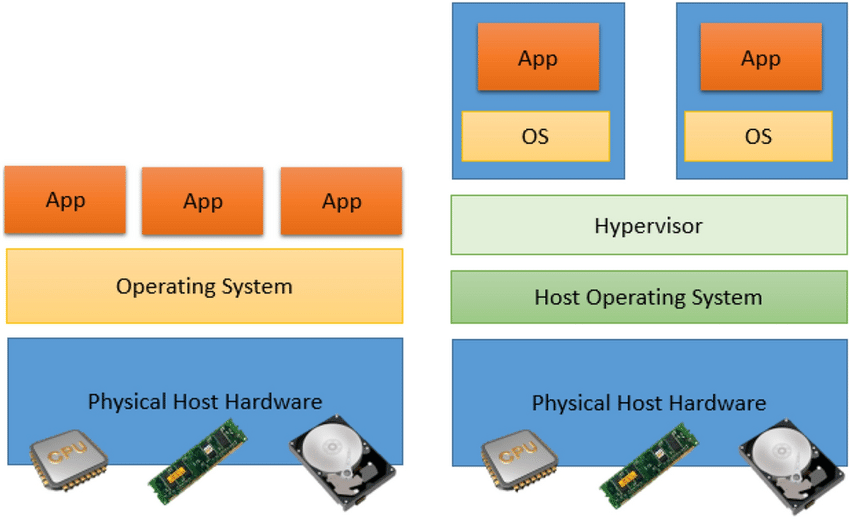
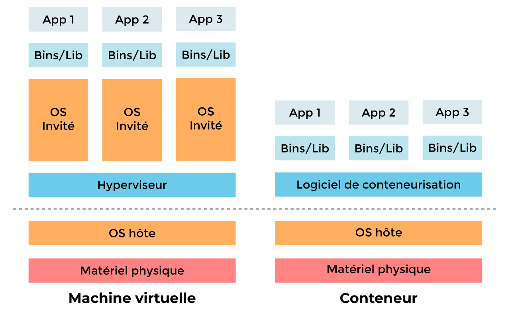
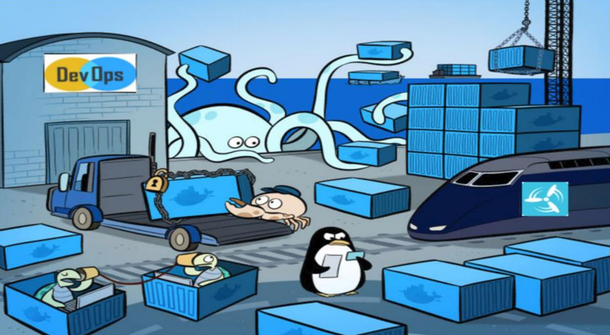
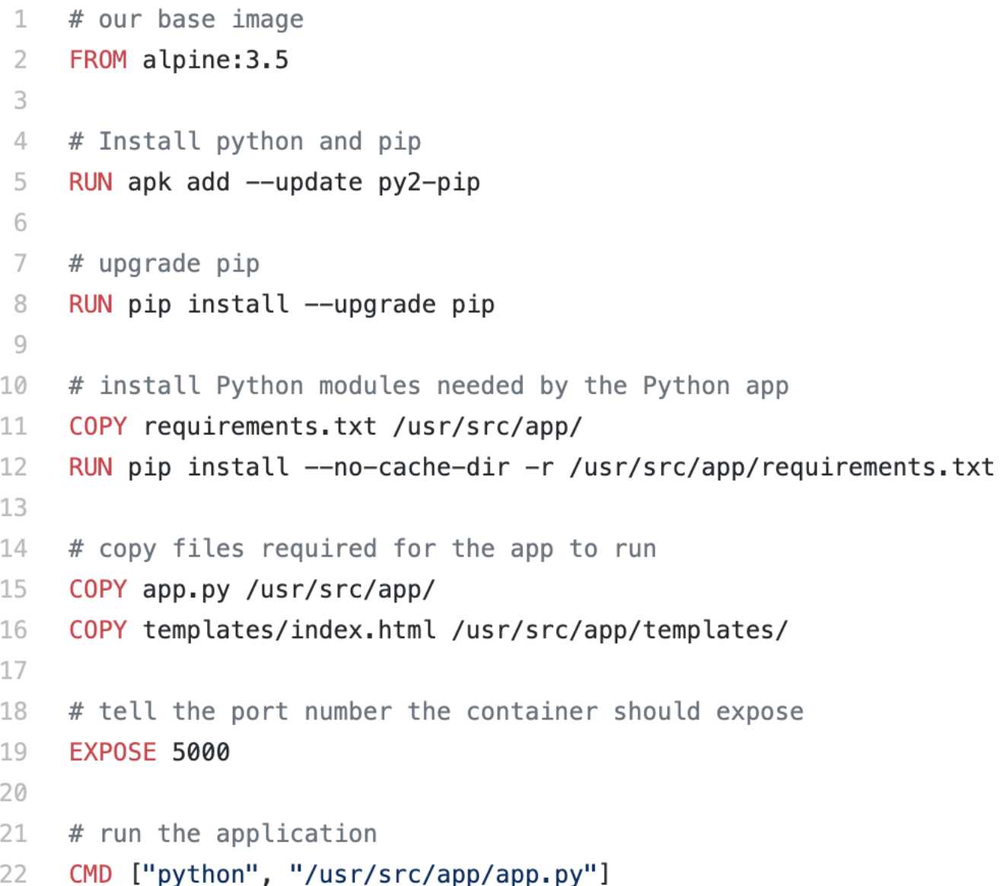

# Séance 1 - Conteneurs avec Docker

<!-- header: Scalabilité, Virtualisation et Conteneurisation -->
<!-- _class: dark -->
<!-- _paginate: false -->

## Sommaire

<!-- header: Séance 1 - Conteneurs avec Docker -->
<!-- _class: toc -->
<!-- _paginate: false -->

1. [Virtualisation](#-1-virtualisation)
2. [Conteneurisation](#-2-conteneurisation)
3. [Docker](#-3-docker)

## <!-- fit --> 1. Virtualisation

<!-- header: Séance 1 - Conteneurs avec Docker -->
<!-- _paginate: false -->

### Qu'est-ce que la virtualisation ? 💡

<!-- header: Séance 1 - Conteneurs avec Docker » 1. Virtualisation -->
<!-- _class: enum -->

* Technologie utilisée pour **créer des représentations virtuelles** de serveurs, de stockage, de réseaux et d'autres machines physiques
* **Imiter le fonctionnement de matériel physique** pour exécuter plusieurs machines virtuelles sur une seule machine physique
* Permettre une **utilisation plus efficace des ressources matérielles**
* Base du cloud computing « Infrastructure en tant que service » (IaaS)

### Comparaison de l'architecture traditionnelle et de l'architecture virtualisée

<!-- _class: figure -->

Implementation and evaluation of a container management platform on Docker: Hadoop deployment as an example - Scientific Figure on ResearchGate. Available from: https://www.researchgate.net/figure/Comparison-of-traditional-architecture-and-virtualized-architecture_fig1_352545350

### Quels avantages de la virtualisation ? 👍

<!-- _class: enum -->

* **Utilisation efficace des ressources matérielles** permettant d'économiser sur le matériel par mutualisation (réduction des coûts : achat, hébergement, maintenance, ...)
* **Gestion informatique automatisée** permettant d'éviter les configurations manuelles sujettes aux erreurs
* **Reprise plus rapide après sinistre** permettant d'améliorer considérablement la résilience et facilite la continuité des activités

### Quels inconvénients de la virtualisation ? 👎

<!-- _class: enum -->

* **Performance dégradée** par la couche d'abstraction matérielle (l'exécution d'un logiciel virtualisé consommera davantage de ressources qu'en mode natif)
* Sans redondance, la panne d'une machine hôte impacte l'ensemble des machines virtuelles hébergées
* **Investissement initial** car la mise en oeuvre est complexe
* Possibles **contraintes administratives** (déploiement, sauvegarde, ...)

## <!-- fit --> 2. Conteneurisation

<!-- header: Séance 1 - Conteneurs avec Docker -->
<!-- _paginate: false -->

### Qu'est-ce que la conteneurisation ? 💡

<!-- header: Séance 1 - Conteneurs avec Docker » 2. Conteneurisation -->
<!-- _class: enum -->

* Technologie utilisée pour **créer des instances d'espace utilisateur isolées**
* **Un conteneur est une enveloppe virtuelle** (sources, environnement d'exécution, librairies, outils et fichiers) assemblée en un ensemble cohérent et prêt à être déployé
* Un programme d'un conteneur est **limité à son contenu et aux périphériques associés** (isolation du processus applicatif du reste du système)
* S'appuie sur le noyau du système d'exploitation sur lequel il est déployé (de l'hôte)

### Comparaison entre les conteneurs et les machines virtuelles

<!-- _class: figure -->

Découvrez les conteneurs - Optimisez votre déploiement en créant des conteneurs avec Docker - OpenClassrooms : https://openclassrooms.com/fr/courses/2035766-optimisez-votre-deploiement-en-creant-des-conteneurs-avec-docker/6211306-decouvrez-les-conteneurs

### Quels avantages de la conteneurisation ? 👍

<!-- _class: enum -->

* **Agilité** ~ Raccourcir les cycles de publication et travailler rapidement sur les mises à jour avec le modèle de conteneur
* **Capacité de mise à l’échelle** ~ Ajouter facilement plusieurs conteneurs pour réaliser de la scalabilité horizontale
* **Légèreté** ~ Exploiter le noyau du système hôte offre une performance supérieure à la virtualisation
* **Portabilité** ~ Déployer une application dans plusieurs environnements sans réécrire le code du programme
* **Tolérance aux pannes** ~ Créer plusieurs conteneurs augmente la résilience et la disponibilité de l'application

### Quels inconvénients de la conteneurisation ? 👎

<!-- _class: enum -->

* Pas adapté pour les applications qui nécessitent une interface graphique
* Difficulté à gérer une grande quantité de conteneurs
* Pas de compatibilité multiplateforme (une application conçue pour s'exécuter dans un conteneur sur Windows, ne peut pas s'exécuter dans un conteneur sur Linux)
* Ne fournit pas de solution pour la sauvegarde et la récupération de données

## <!-- fit --> 3. Docker

<!-- header: Séance 1 - Conteneurs avec Docker -->
<!-- _paginate: false -->

### Docker

<!-- header: Séance 1 - Conteneurs avec Docker » 3. Docker -->
<!-- _class: enum -->

* Créé dans les années 2010 par [Solomon Hykes](https://fr.wikipedia.org/wiki/Solomon_Hykes) (_dotCloud_)
* Plateforme permettant de **lancer des applications dans des conteneurs logiciels**
* Distribué en tant que projet open source à partir de mars 2013

### Docker Architecture

<!-- _class: figure -->

Docker overview | Docker Documentation : https://docs.docker.com/get-started/overview/

### Docker Engine

<!-- _class: enum -->

* **docker daemon** (dockerd) : processus long chargé de la création et de la gestion des conteneurs
* **REST API** : API REST définissant un ensemble d’interfaces pour interagir avec dockerd
* **docker CLI** : Interface en ligne de commande pour interagir avec dockerd

### Docker Registry

<!-- _class: enum -->

* Un registre Docker **stocke des images Docker**
* [Docker Hub](https://hub.docker.com/) est un registre public configuré par défaut
* Solutions de registres privés : [Container registry](https://cloud.google.com/container-registry/), [Artifactory](https://www.jfrog.com/confluence/display/RTF/Getting+Started+with+Artifactory+as+a+Docker+Registry), ...
* `docker pull` ou `docker run` récupère une image depuis le registre configuré
* `docker push` publie l'image sur le registre configuré

### Docker Image

<!-- _class: enum -->

* Toute image Docker repose sur une image source (Ubuntu, CentOS, Debian, Alpine)
* Une image contient _n_ instructions permettant sa construction
* Elle possède un nom, une version et un tag (par défaut « latest »)

### Docker Build & Run

<!-- _class: figure -->

Getting started with Docker - images and containers - By Fernando Briano - 6 november, 2017
https://cultivatehq.com/posts/docker/

### Pourquoi adopter Docker ?

<!-- _class: enum -->

* Accélérer le développement d’une application métier
* Intégration simple dans les chaînes d'intégration et de déploiement continues ([Gitlab CI/CD](https://docs.gitlab.com/ee/ci/), [Bitbucket](http://bitbuck.com/), [CircleCI](https://circleci.com/), ...)
* Un conteneur est de part sa nature « portable », capacité à s’exécuter une machine locale, serveur physique ou virtuel, cloud
* La taille réduite d’un conteneur et le fait qu’il soit « stateless » permet une montée en charge horizontale simplifiée en un temps très court

### Qu’en est-il de la sécurité ?

<!-- _class: enum -->

* Un conteneur (et ses privilèges) est un processus classique
* Attention à ne pas exécuter les processus sous l’utilisateur « root »
* Être vigilant sur les images sources utilisées
<!--
* Une bonne partie du sous-système du kernel Linux ne possèdes pas encore d’espace de noms (SELinux, /sys, /proc)
-->

### <!-- fit --> Quelles sont les limitations ?

<!-- _class: enum -->

* Comment orchestrer des dizaines, centaines de conteneurs uniques à la base ?
* Compliqué d’avoir un service type « cron », « syslog » au sein d’un conteneur Docker
* Le démon Docker nécessitant des droits « root », ce qui le rend sensible aux attaques

## Références

<!-- header: "" -->
<!-- _class: dark references -->
<!-- _paginate: false -->

* AWS - Qu’est-ce que la conteneurisation ? https://aws.amazon.com/fr/what-is/containerization/
* AWS - Qu'est-ce que la virtualisation ? https://aws.amazon.com/fr/what-is/virtualization/
* Docker - Docker documentation https://docs.docker.com
* Wikipédia - Conteneur (informatique) https://fr.wikipedia.org/wiki/Conteneur_(informatique)
* Wikipédia - Conteneur (virtualisation) https://fr.wikipedia.org/wiki/Conteneur_(virtualisation)
* Wikipédia - Virtualisation https://fr.wikipedia.org/wiki/Virtualisation
