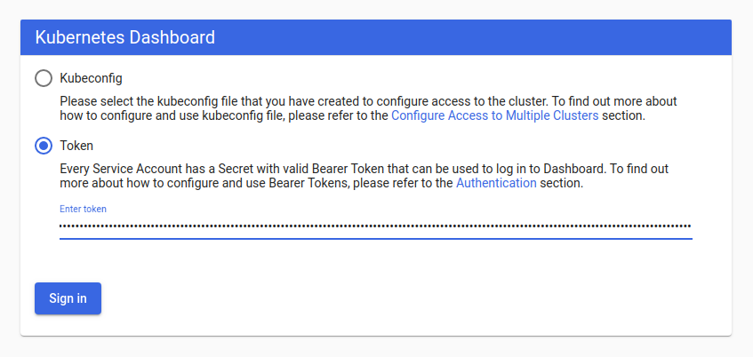
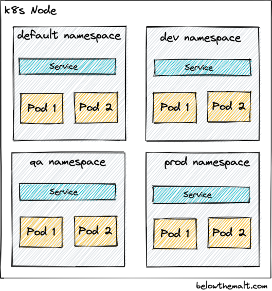
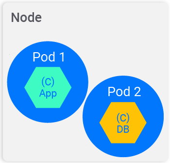
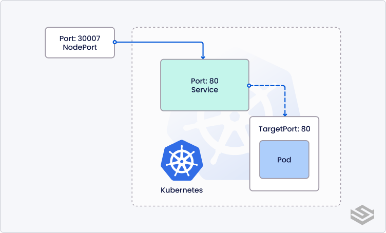
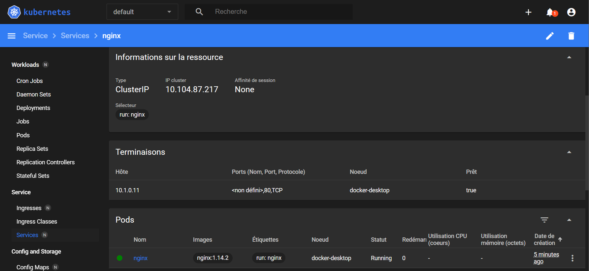
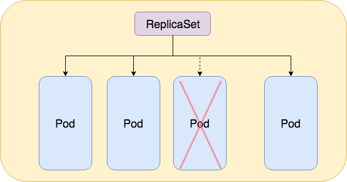
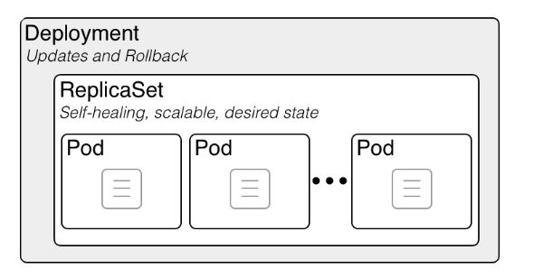
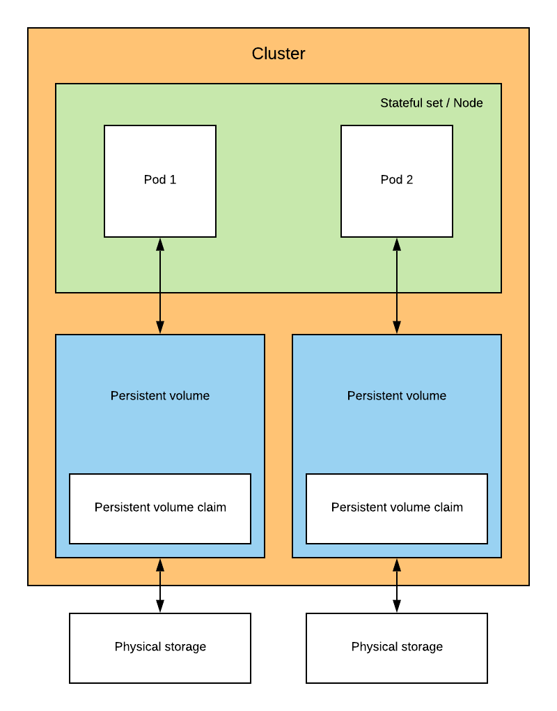
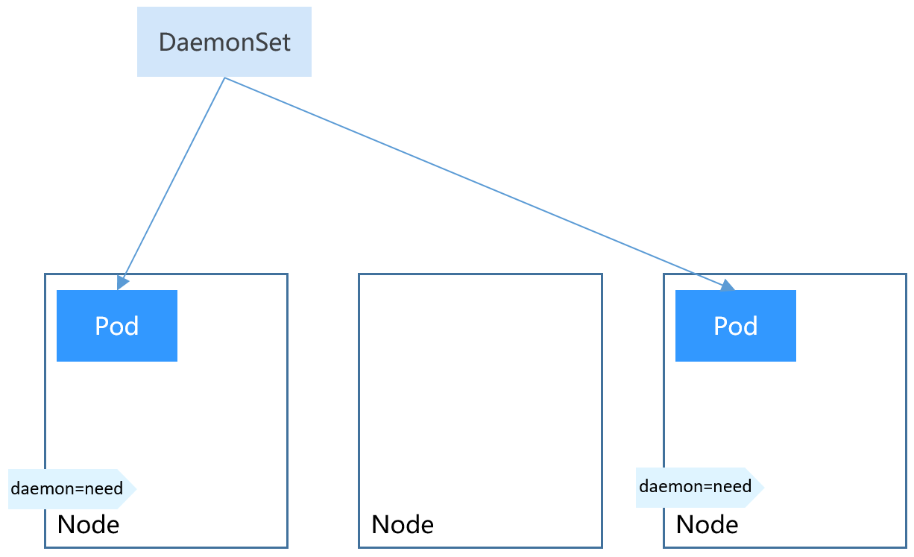

# Séance 4 - Kubernetes

<!-- header: Scalabilité, Virtualisation et Conteneurisation -->
<!-- _class: dark -->
<!-- _paginate: false -->

## Sommaire

<!-- header: Séance 4 - Kubernetes -->
<!-- _class: toc -->
<!-- _paginate: false -->

1. [Qu'est-ce que Kubernetes ?](#-1-qu-est-ce-kubernetes)
2. [Composants de Kubernetes](#-2-composants-de-kubernetes)
3. [Objets de Kubernetes](#-3-objets-de-kubernetes)

## <!-- fit --> 1. Qu'est-ce que Kubernetes ?

<!-- header: Séance 4 - Kubernetes » 1. Qu'est-ce que Kubernetes ? -->
<!-- _header: Séance 4 - Kubernetes -->
<!-- _paginate: false -->

### Qu'est-ce que Kubernetes ?

<!-- _class: enum -->

* **Plateforme pour la gestion de charges de travail (workloads) et de services conteneurisés**
* Basé sur une décénie et demie d'expérience de Google avec [Borg](https://research.google/pubs/pub43438/)
* Google a rendu open source Kubernetes en 2014 et l'a offert à la [Cloud Native Computing Foundation](https://www.cncf.io/) (appartenant à la [Linux Foundation](https://www.linuxfoundation.org/))


### Que peut faire Kubernetes ?

<!-- _class: enum -->

* Peut être considéré comme une plateforme de conteneurs, ou une plateforme de microservices, ou une plateforme cloud portable ou plus encore
* Fournit un environnement de **gestion focalisé sur le conteneur** (_container-centric_)
* **Orchestre les ressources machines (_computing_), la mise en réseau et l'infrastructure de stockage sur les workloads des utilisateurs**
* Se rapproche de la simplicité des _Platform as a Service_ (PaaS) avec la flexibilité des solutions d'_Infrastructure as a Service_ (IaaS), tout en gardant de la portabilité entre les différents fournisseurs d'infrastructures (_providers_)

### Déploiements classiques VS conteneurs

<!-- _class: figure -->


Kubernetes Documentation / Concepts / Vue d'ensemble / Qu'est-ce-que Kubernetes ? : https://kubernetes.io/fr/docs/concepts/overview/what-is-kubernetes/

### Kubernetes dans l'ère des conteneurs

<!-- _class: figure -->


Going back in time : https://kubernetes.io/docs/concepts/overview/#going-back-in-time

### Pourquoi les conteneurs ? (1/2)

<!-- _class: enum -->

* **Création et déploiement agile d'applications** : Augmente la simplicité et l'efficacité de la création d'images par rapport à l'utilisation d'images de VM.
* **Développement, intégration et déploiement Continus** : Fournit un processus pour constuire et déployer fréquemment et de façon fiable avec la capacité de faire des rollbacks rapides et simples (grâce à l'immuabilité de l'image).
* **Séparation des besoins entre Dev et Ops** : Création d'images applicatives au build plutôt qu'au déploiement, tout en séparant l'application de l'infrastructure.
* **Observabilité** : Informations venant non seulement du système d'exploitation sous-jacent mais aussi des signaux propres de l'application.
* **Consistance entre les environnements de développement, tests et production** : Fonctionne de la même manière que ce soit sur un poste local que chez un fournisseur.

### Pourquoi les conteneurs ? (2/2)

<!-- _class: enum -->

* **Portabilité entre Cloud et distribution système** : Fonctionne sur Ubuntu, RHEL, CoreOS, on-prem, Google Kubernetes Engine, et n'importe où.
* **Gestion centrée Application** : Bascule le niveau d'abstraction d'une virtualisation hardware liée à l'OS à une logique de ressources orientée application.
* **[Micro-services](https://martinfowler.com/articles/microservices.html) faiblement couplés, distribués, élastiques** : Les applications sont séparées en petits morceaux indépendants et peuvent être déployées et gérées dynamiquement (pas une stack monolithique dans une seule machine à tout faire).
* **Isolation des ressources** : Performances de l'application prédictibles.
* **Utilisation des ressources** : Haute efficacité et densité.

### [Considérations pour les grands clusters](https://kubernetes.io/docs/setup/best-practices/cluster-large/)

<!-- _class: enum -->

* **Kubernetes v1.26 supporte des clusters jusqu'à 5000 nodes**
* Pas plus de 110 Pods par node
* Pas plus de 150 000 Pods au total
* Pas plus de 300 000 conteneurs au total

## <!-- fit --> 2. Composants de Kubernetes

<!-- header: Séance 4 - Kubernetes » 2. Composants de Kubernetes -->
<!-- _header: Séance 4 - Kubernetes -->
<!-- _paginate: false -->

### Les types de nœuds d'un cluster Kubernetes

<!-- _class: enum -->

Un cluster Kubernetes est composé de _worker nodes_ pilotés par un _control plane_.

#### Control Plane / Master node

* Couche d'orchestration qui planifie et répond aux événements du cluster
* Expose l'[API Kubernetes](https://kubernetes.io/docs/concepts/overview/kubernetes-api/) pour gérer le cycle de vie des conteneurs
* Les devops interagissent avec le Control Plane (via [kubectl](https://kubernetes.io/docs/reference/kubectl/) ou [Dashboard](https://kubernetes.io/docs/tasks/access-application-cluster/web-ui-dashboard/))

#### Worker node

* Un _node_ est une machine de travail exécutant des applications conteneurisées
* Un _node_ héberge des _[Pods](https://kubernetes.io/docs/concepts/workloads/pods/)_ dans lesquels s'exécutent les conteneurs
* Un _node_ peut être une machine physique ou virtuelle ou une instance cloud

### Les composants d'un cluster Kubernetes

<!-- _class: figure -->


Diagramme d'architecture de Kubernetes : https://fr.wikipedia.org/wiki/Kubernetes

### Les composants du Control Plane

<!-- _class: enum -->

* [`etcd`](https://etcd.io/) : Base de stockage (clé-valeur) distribuée des données de configuration représentant l'état du cluster
* [`kube-apiserver`](https://kubernetes.io/docs/reference/command-line-tools-reference/kube-apiserver/) : Serveur HTTP exposant l'[API Kubernetes](https://kubernetes.io/docs/concepts/overview/kubernetes-api/) (voir [client libraries](https://kubernetes.io/docs/reference/using-api/client-libraries/))
* [`kube-scheduler`](https://kubernetes.io/docs/reference/command-line-tools-reference/kube-scheduler/) : Ordonnanceur surveillant les Pods nouvellement créés qui ne sont pas assignés à un nœud et sélectionne un nœud sur lequel ils vont s'exécuter
* [`kube-controller-manager`](https://kubernetes.io/docs/reference/command-line-tools-reference/kube-controller-manager/) : Le gestionnaire de contrôle est le processus dans lequel s'exécutent les contrôleurs principaux de Kubernetes et assurent l'état désiré du cluster
* [`cloud-controller-manager`](https://kubernetes.io/docs/concepts/overview/components/#cloud-controller-manager) : Permet de faire le lien entre le cluster et l'API d'un fournisseur d'hébergement / dans le Cloud

### Les composants des Nodes

<!-- _class: enum -->

* [`kubelet`](https://kubernetes.io/docs/reference/command-line-tools-reference/kubelet/) : Agent qui s'exécute sur chaque nœud pour s'assurer que les conteneurs fonctionnent dans un Pod
* `cAdvisor` : Agent intégré à `kubelet` surveillant la consommation des ressources et les performances des conteneurs (collecte statistiques CPU, mémoire, disque et réseau)
* [`kube-proxy`](https://kubernetes.io/docs/reference/command-line-tools-reference/kube-proxy/) : Proxy réseau qui s'exécute sur chaque nœud pour réaliser le routage du trafic vers le conteneur approprié
* [Container Runtime](https://kubernetes.io/docs/concepts/overview/components/#container-runtime) : Logiciel responsable de l'exécution de conteneurs (implémentant Kubernetes [**C**ontainer **R**untime **I**nterface](https://github.com/kubernetes/community/blob/master/contributors/devel/sig-node/container-runtime-interface.md))

### Les composants complémentaires (addons)

<!-- _class: enum -->

Les addons utilisent les ressources Kubernetes (DaemonSet, Déploiement, etc) pour implémenter des fonctionnalités cluster.

* [Networking and Network Policy](https://kubernetes.io/docs/concepts/cluster-administration/addons/#networking-and-network-policy)
* [Service discovery](https://kubernetes.io/docs/concepts/cluster-administration/addons/#service-discovery)
* [Visualization & Control](https://kubernetes.io/docs/concepts/cluster-administration/addons/#visualization-amp-control)
* [Infrastructure](https://kubernetes.io/docs/concepts/cluster-administration/addons/#infrastructure)
* [Legacy Add-ons](https://kubernetes.io/docs/concepts/cluster-administration/addons/#legacy-add-ons)

### Flux de planification d'un Pod

<!-- _class: figure -->


<!-- Source : https://kubernetes.io/blog/2023/01/12/protect-mission-critical-pods-priorityclass/#resource-management-in-kubernetes -->

### Séquence de planification d'un Pod

<!-- _class: figure -->


<!--
```mermaid
sequenceDiagram
  user/kubectl->>+master/api_server: Créer un Pod
  master/api_server-)+master/etcd: Sauvegarder l'état
  master/api_server-- >>-user/kubectl: Ok
  rect rgb(159,252,253)
    master/scheduler->>+master/api_server: Observer les Pods non-assignés
    master/api_server-- >>-master/scheduler: Pod (with nodeName="")
    master/scheduler->>+master/api_server: Assigner un Pod à un node
    master/api_server-)master/etcd: Sauvegarder l'état
    master/api_server-- >>-master/scheduler: Ok
  end
  rect rgb(255,254,145)
    worker/kubelet->>+master/api_server: Observer les Pods assignés
    master/api_server-- >>-worker/kubelet: Nouveau Pod
    worker/kubelet->>worker/container_runtime: Démarrer le(s) conteneur(s)
    worker/kubelet->>+master/api_server: Mettre à jour l'état du Pod
    master/api_server-)master/etcd: Sauvegarder l'état
    master/api_server-- >>-worker/kubelet: Ok
  end
```
-->

### Kubernetes Dashboard (1/2)

<!-- _class: enum -->

* **Interface web pour gérer des clusters Kubernetes** ([dépôt GitHub](https://github.com/kubernetes/dashboard))
* Déployer le Dashboard :
  ```shell
  kubectl apply -f https://raw.githubusercontent.com/kubernetes/dashboard/v2.7.0/aio/deploy/recommended.yaml
  ```
* Tunnel sécurisé d'accès :
  ```shell
  kubectl proxy
  ```
* URL d'accès au Dashboard : http://localhost:8001/api/v1/namespaces/kubernetes-dashboard/services/https:kubernetes-dashboard:/proxy/


### Kubernetes Dashboard (2/2)

<!-- _class: enum -->

* Créer un _ServiceAccount_ `admin-user` avec un _ClusterRoleBinding_ `cluster-admin` dans le namespace `kubernetes-dashboard` ([manifest](./k8s/dashboard-adminuser.yaml)) :
  ```shell
  kubectl apply -f docs/k8s/dashboard-adminuser.yaml
  ```
* Créer un Bearer Token :
  ```shell
  kubectl -n kubernetes-dashboard create token admin-user
  ```
* Voir [guide pour obtenir un token d'accès au Dashboard](https://github.com/kubernetes/dashboard/blob/master/docs/user/access-control/creating-sample-user.md)



## <!-- fit --> 3. Objets de Kubernetes

<!-- header: Séance 4 - Kubernetes » 3. Objets de Kubernetes -->
<!-- _header: Séance 4 - Kubernetes -->
<!-- _paginate: false -->

### Les objets de Kubernetes

<!-- _class: enum -->

* Kubernetes contient des **abstractions représentant l'état du cluster** : applications et processus conteneurisés déployés, leurs ressources réseau et disque associées, ainsi que d'autres informations sur les activités
* Ces abstractions sont représentées par des **objets de l'API Kubernetes**
* Objets de base de Kubernetes : [Pod](https://kubernetes.io/docs/concepts/workloads/pods/pod-overview/), [Service](https://kubernetes.io/docs/concepts/services-networking/service/), [Volume](https://kubernetes.io/docs/concepts/storage/volumes/), [Namespace](https://kubernetes.io/docs/concepts/overview/working-with-objects/namespaces/)
* Les contrôleurs sont des abstractions de niveau supérieur (s'appuyant sur les objets de base) : [ReplicaSet](https://kubernetes.io/docs/concepts/overview/working-with-objects/namespaces/), [Deployment](https://kubernetes.io/docs/concepts/workloads/controllers/deployment/), [StatefulSet](https://kubernetes.io/docs/concepts/workloads/controllers/statefulset/), [DaemonSet](https://kubernetes.io/docs/concepts/workloads/controllers/daemonset/), [Job](https://kubernetes.io/docs/concepts/workloads/controllers/jobs-run-to-completion/)
* L'interface en ligne de commande `kubectl` est utilisée pour créer des objets de manière impérative (`kubectl run <conteneur> ...`, `kubectl expose ...`) ou déclarative via des fichiers YAML ou JSON (`kubectl apply -f monpod.yml`)

### L'architecture découplée des services Kubernetes 

<!-- _class: figure -->


L'architecture découplée des services Kubernetes : https://supports.uptime-formation.fr/05-kubernetes/04_cours_k8s_objects_1

### Namespace (1/2)

<!-- _class: enum -->

* Un namespace est un **espace de travail isolé regroupant des objets Kubernetes**
* Des **limitations de ressources** (CPU, ...) peuvent être configurées par namespace
* Des **rôles et permissions** peuvent être définies par namespace



### Namespace (2/2)

<!-- _class: enum -->

* [Lister les namespaces](https://kubernetes.io/docs/concepts/overview/working-with-objects/namespaces/#viewing-namespaces) : `kubectl get namespace`
* Le namespace `default` est utilisé pour les objets créés sans préciser `--namespace`
* Kubernetes inclut [4 namespaces initiaux](https://kubernetes.io/docs/concepts/overview/working-with-objects/namespaces/#initial-namespaces) :

| Nom | Description |
|-|-|
| `default` | Namespace par défaut. |
| `kube-node-lease` | Namespace des objets [Lease](https://kubernetes.io/docs/concepts/architecture/leases/) associés à chaque node. |
| `kube-public` | Namespace réservé à l'usage du cluster (accès public). |
| `kube-system` | Namespace pour les objets créés par le système Kubernetes. |

### Pod (1/3)

<!-- _class: enum -->

* **Unité la plus petite hébergeant les conteneurs d'une application**
* Les conteneurs d'un Pod partagent la même IP, nom de domaine et stockage
* Augmenter le nombre de Pods (replicas) permet la mise à l'échelle
* La sonde [_liveness_](https://kubernetes.io/docs/tasks/configure-pod-container/configure-liveness-readiness-startup-probes/#define-a-liveness-command) confirme qu'un conteneur est en cours d'exécution
* La sonde [_readiness_](https://kubernetes.io/docs/tasks/configure-pod-container/configure-liveness-readiness-startup-probes/#define-readiness-probes) confirme qu'un conteneur a bien démarré



### Pod (2/3)

```shell
kubectl apply --filename=docs/k8s/hello-pod.yaml
```

```yaml
apiVersion: v1
kind: Pod
metadata:
  name: hello-pod
  labels:
    app.kubernetes.io/name: hello
spec:
  containers:
    - name: hello
      image: kennship/http-echo # Source: https://github.com/kennship/http-echo
```

### Pod (3/3)

<!-- _class: enum -->

Kubernetes fournit des commandes pour interragir avec les conteneurs d'un Pod.

`kubectl get pods`

`kubectl get pods <pod-name> --output="jsonpath={.spec.containers[*].name}"`

`kubectl logs <pod-name> [--container=<container-name>]`

`kubectl exec --stdin --tty <pod-name> [--container=<container-name>] -- bash`

`kubectl attach --stdin --tty <pod-name> [--container=<container-name>]`

`kubectl port-forward <pod-name> [<local_port>:]<remote_port>`

`kubectl delete pod <pod-name> [--force] [--now]`

`...` voir [`kubectl` Cheat Sheet](https://kubernetes.io/docs/reference/kubectl/cheatsheet/)

### Service (1/2)

<!-- _class: enum -->

* Désigne un **ensemble logique de Pods** (grâce à des tags) **exposés en tant que service réseau** (niveau d'abstraction au-dessus du Pod)
* Fournit un endpoint réseau pour les requêtes à destination des Pods (_chaque Pod possède sa propre IP volatile donc non pérenne_)
* Définit politique d'accès aux Pods de l'intérieur ou l'extérieur du cluster
* **Les Pods ciblés par un service est déterminé par un `selector`**



### Service (2/2)

```shell
kubectl apply --filename=docs/k8s/hello-service.yaml
```

```yaml
apiVersion: v1
kind: Service
metadata:
  name: hello-service
spec:
  selector:
    app.kubernetes.io/name: hello
  ports:
    - name: hello-port
      protocol: TCP
      port: 3000 # Default port for image: kennship/http-echo
```



### Ingress (1/3)

<!-- _class: enum -->

* **Objet qui gère l'accès externe à un service du cluster**
* Peut fournir un équilibrage de charge, une terminaison TLS et un hébergement virtuel basé sur un nom
* Un Ingress n'expose pas de ports/protocoles arbitraires
* [Installer l'Ingress-NGINX Controller pour Kubernetes](https://github.com/kubernetes/ingress-nginx/blob/controller-v1.7.0/docs/deploy/index.md#quick-start) :
  ```shell
  kubectl apply -f https://raw.githubusercontent.com/kubernetes/ingress-nginx/controller-v1.6.4/deploy/static/provider/cloud/deploy.yaml
  ```



### Ingress (2/3)

```shell
kubectl apply --filename=docs/k8s/hello-ingress.yaml
```

```yaml
apiVersion: networking.k8s.io/v1
kind: Ingress
metadata:
  name: hello-ingress
  annotations:
    kubernetes.io/ingress.class: nginx
    nginx.ingress.kubernetes.io/rewrite-target: /
spec:
  rules:
    - http:
        paths:
          - path: /hello
            pathType: Prefix
            backend:
              service:
                name: hello-service
                port:
                  name: hello-port
```

### Ingress (3/3)

<!-- _class: enum -->

Des annotations permettent de personnaliser le comportement d'un Ingress.

|Nom|Description|Type|
| --- | --- | --- |
| [`nginx.ingress.kubernetes.io/rewrite-target`](https://github.com/kubernetes/ingress-nginx/blob/main/docs/user-guide/nginx-configuration/annotations.md#rewrite) | Target URI where the traffic must be redirected | _string_ |
| [`nginx.ingress.kubernetes.io/app-root`](https://github.com/kubernetes/ingress-nginx/blob/main/docs/user-guide/nginx-configuration/annotations.md#rewrite) | Defines the Application Root that the Controller must redirect if it's in `/` context | _string_ |
| [`...`](https://github.com/kubernetes/ingress-nginx/blob/main/docs/user-guide/nginx-configuration/annotations.md) | [Voir la liste des annotations](https://github.com/kubernetes/ingress-nginx/blob/main/docs/user-guide/nginx-configuration/annotations.md) | [_..._](https://github.com/kubernetes/ingress-nginx/blob/main/docs/user-guide/nginx-configuration/annotations.md) |

### ConfigMap

<!-- _class: enum -->

* **Permet d’injecter dans les pods des clés/valeur de config non-confidentielles**
* [Une ConfigMap peut être utilisée](https://kubernetes.io/docs/concepts/configuration/configmap/#configmap-configure-pod-yaml) en variable d'environnement, en arguments de la ligne de commande ou en fichiers de configuration dans un volume
* Les Pods ne sont pas avertis des changements sur un ConfigMap

```yaml
apiVersion: v1
kind: ConfigMap
metadata:
  name: game-demo
data:
  # property-like keys; each key maps to a simple value
  player_initial_lives: "3"
  # file-like keys
  game.properties: |
    player.maximum-lives=5    
  user-interface.properties: |
    color.lives=pink
```

### Secret

<!-- _class: enum -->

* **Similaire à la ConfigMap mais pour les données confidentielles**
* Permet d'éviter d'inclure des données confidentielles dans le code applicatif
* Stockés sur tmpfs (RAM) et non sur le disque des nœuds
* [Voir documentation des secrets](https://kubernetes.io/docs/concepts/configuration/secret)

### ReplicaSet (1/2)

<!-- _class: enum -->

* **Un ReplicaSet permet d'assurer que les réplicas spécifiés sont actifs**
* Un Pod est un élément unitaire non scalable et donc non-tolérent aux pannes
* Le lien entre un Pod et un ReplicaSet s’effectue via des Labels
* Observe et réagit aux changements de la définition des Pods



### ReplicaSet (2/2)

```shell
kubectl apply --filename=docs/k8s/hello-replicaset.yaml
```

```yaml
apiVersion: apps/v1
kind: ReplicaSet
metadata:
  name: hello-replicaset
  labels:
    app.kubernetes.io/name: hello
spec:
  replicas: 2
  selector:
    matchLabels:
      app.kubernetes.io/name: hello
  template:
    metadata:
      labels:
        app.kubernetes.io/name: hello
    spec:
      containers:
        - name: hello
          image: kennship/http-echo # Source: https://github.com/kennship/http-echo
```

### Deployment (1/2)

<!-- _class: enum -->

* **Décrit le cycle de vie d'une application** (images à utiliser, le nombre de pods à exécuter, etc) **et la façon de la mettre à jour**
* Moyen déclaratif de mettre à jour une application
* Permet d'automatiser le processus de déploiement de nouveaux Pods



### Deployment (2/2)

```shell
kubectl apply --filename=docs/k8s/hello-deployment.yaml
```

```yaml
apiVersion: apps/v1
kind: Deployment
metadata:
  name: hello-deployment
  labels:
    app.kubernetes.io/name: hello
spec:
  replicas: 2
  selector:
    matchLabels:
      app.kubernetes.io/name: hello
  template:
    metadata:
      labels:
        app.kubernetes.io/name: hello
    spec:
      containers:
        - name: hello
          image: kennship/http-echo # Source: https://github.com/kennship/http-echo
```

### StatefulSet

<!-- _class: enum -->

* **Adapté pour déployer des applications avec état** et des applications qui enregistrent des données sur un stockage persistant
* Représente un ensemble de Pods dotés d'identités uniques et persistantes et de noms d'hôtes stables
* Similaire au ReplicaSet mais peut utiliser un _storage_ persistant (permet de stocker des données sans les perdre à la destruction d'un Pod)



### DaemonSet

<!-- _class: enum -->

* **Introduit une adhérence entre Pods et topologie du cluster**
* Exemple de création d'un Pod uniquement sur les nodes ayant l'étiquette de sélection `daemon=need`



### Job

<!-- _class: enum -->

* **Relance des Pods jusqu'à obtenir un certain nombre d'exécution avec succès**
* Une [multitude d'usages des jobs sont possibles](https://kubernetes.io/docs/concepts/workloads/controllers/job/#job-patterns)

```shell
kubectl apply -f https://kubernetes.io/examples/controllers/job.yaml
```

```yaml
apiVersion: batch/v1
kind: Job
metadata:
  name: pi
spec:
  template:
    spec:
      containers:
      - name: pi
        image: perl:5.34.0
        command: ["perl",  "-Mbignum=bpi", "-wle", "print bpi(2000)"]
      restartPolicy: Never
  backoffLimit: 4
  completions: 1
```

### Kubernetes Resources Map

<!-- _class: figure -->


Kubernetes Resources : https://jayendrapatil.com/kubernetes-components/

## Références

<!-- header: "" -->
<!-- _class: dark references -->
<!-- _paginate: false -->

* Documentation de Kubernetes<br>https://kubernetes.io/fr/docs/home/
* Kubernetes Documentation / Deploy and Access the Kubernetes Dashboard<br>https://kubernetes.io/docs/tasks/access-application-cluster/web-ui-dashboard/
* Kubernetes Glossary<br>https://kubernetes.io/docs/reference/glossary/
* Kubernetes Reference / `kubectl` Cheat Sheet<br>https://kubernetes.io/docs/reference/kubectl/cheatsheet/
* Kubernetes Reference / Kubernetes API<br>https://kubernetes.io/docs/reference/kubernetes-api/
* Kubernetes Tutorials / Hello Minikube<br>https://kubernetes.io/docs/tutorials/hello-minikube/