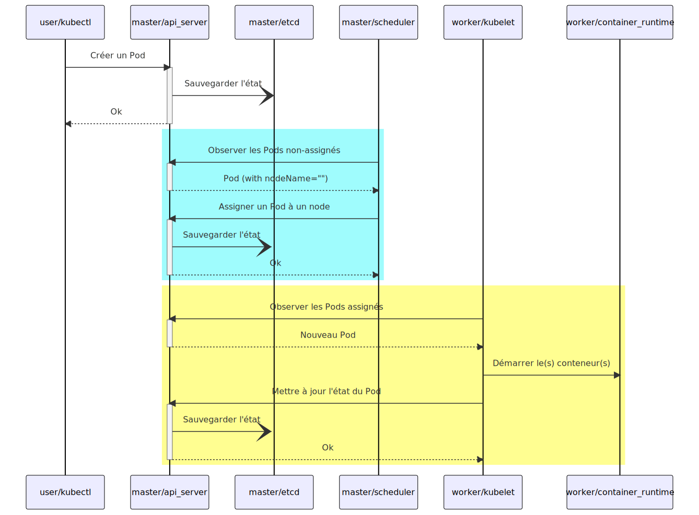

# Séance 4 - Kubernetes

<!-- header: Scalabilité, Virtualisation et Conteneurisation -->
<!-- _class: dark -->
<!-- _paginate: false -->

## Sommaire

<!-- header: Séance 4 - Kubernetes -->
<!-- _class: toc -->
<!-- _paginate: false -->

1. [Qu'est-ce que Kubernetes ?](#-1-qu-est-ce-kubernetes)
2. [Composants de Kubernetes](#-2-composants-de-kubernetes)
3. [Objets de Kubernetes](#-3-objets-de-kubernetes)

## <!-- fit --> 1. Qu'est-ce que Kubernetes ?

<!-- header: Séance 4 - Kubernetes » 1. Qu'est-ce que Kubernetes ? -->
<!-- _header: Séance 4 - Kubernetes -->
<!-- _paginate: false -->

### Qu'est-ce que Kubernetes ?

<!-- _class: enum -->

* **Plateforme pour la gestion de charges de travail (workloads) et de services conteneurisés**
* Basé sur une décénie et demie d'expérience de Google avec [Borg](https://research.google/pubs/pub43438/)
* Google a rendu open source Kubernetes en 2014 et l'a offert à la [Cloud Native Computing Foundation](https://www.cncf.io/) (appartenant à la [Linux Foundation](https://www.linuxfoundation.org/))


### Que peut faire Kubernetes ?

<!-- _class: enum -->

* Peut être considéré comme une plateforme de conteneurs, ou une plateforme de microservices, ou une plateforme cloud portable ou plus encore
* Fournit un environnement de **gestion focalisé sur le conteneur** (_container-centric_)
* **Orchestre les ressources machines (_computing_), la mise en réseau et l'infrastructure de stockage sur les workloads des utilisateurs**
* Se rapproche de la simplicité des _Platform as a Service_ (PaaS) avec la flexibilité des solutions d'_Infrastructure as a Service_ (IaaS), tout en gardant de la portabilité entre les différents fournisseurs d'infrastructures (_providers_)

### Pourquoi les conteneurs ?

<!-- _class: figure -->


Kubernetes Documentation / Concepts / Vue d'ensemble / Qu'est-ce-que Kubernetes ? : https://kubernetes.io/fr/docs/concepts/overview/what-is-kubernetes/

### Pourquoi les conteneurs ? (2)

<!-- _class: enum -->

* **Création et déploiement agile d'applications** : Augmente la simplicité et l'efficacité de la création d'images par rapport à l'utilisation d'images de VM.
* **Développement, intégration et déploiement Continus** : Fournit un processus pour constuire et déployer fréquemment et de façon fiable avec la capacité de faire des rollbacks rapides et simples (grâce à l'immuabilité de l'image).
* **Séparation des besoins entre Dev et Ops** : Création d'images applicatives au build plutôt qu'au déploiement, tout en séparant l'application de l'infrastructure.
* **Observabilité** : Informations venant non seulement du système d'exploitation sous-jacent mais aussi des signaux propres de l'application.
* **Consistance entre les environnements de développement, tests et production** : Fonctionne de la même manière que ce soit sur un poste local que chez un fournisseur.

### Pourquoi les conteneurs ? (3)

<!-- _class: enum -->

* **Portabilité entre Cloud et distribution système** : Fonctionne sur Ubuntu, RHEL, CoreOS, on-prem, Google Kubernetes Engine, et n'importe où.
* **Gestion centrée Application** : Bascule le niveau d'abstraction d'une virtualisation hardware liée à l'OS à une logique de ressources orientée application.
* **[Micro-services](https://martinfowler.com/articles/microservices.html) faiblement couplés, distribués, élastiques** : Les applications sont séparées en petits morceaux indépendants et peuvent être déployées et gérées dynamiquement (pas une stack monolithique dans une seule machine à tout faire).
* **Isolation des ressources** : Performances de l'application prédictibles.
* **Utilisation des ressources** : Haute efficacité et densité.

### [Considérations pour les grands clusters](https://kubernetes.io/docs/setup/best-practices/cluster-large/)

<!-- _class: enum -->

* Kubernetes v1.26 supporte des clusters jusqu'à 5000 nodes
* Pas plus de 110 Pods par node
* Pas plus de 150 000 Pods au total
* Pas plus de 300 000 conteneurs au total

## <!-- fit --> 2. Composants de Kubernetes

<!-- header: Séance 4 - Kubernetes » 2. Composants de Kubernetes -->
<!-- _header: Séance 4 - Kubernetes -->
<!-- _paginate: false -->

### Les types de nœuds d'un cluster Kubernetes

<!-- _class: enum -->

Un cluster Kubernetes est composé de _worker nodes_ pilotés par un _control plane_.

#### Control Plane

* Couche d'orchestration qui planifie et répond aux événements du cluster
* Expose l'[API Kubernetes](https://kubernetes.io/docs/concepts/overview/kubernetes-api/) pour gérer le cycle de vie des conteneurs
* Les devops interagissent avec le Control Plane (via [kubectl](https://kubernetes.io/docs/reference/kubectl/) ou [Dashboard](https://kubernetes.io/docs/tasks/access-application-cluster/web-ui-dashboard/))

#### Worker node

* Un _node_ est une machine de travail exécutant des applications conteneurisées
* Un _node_ héberge des _[Pods](https://kubernetes.io/docs/concepts/workloads/pods/)_ dans lesquels s'exécutent les conteneurs
* Un _node_ peut être une machine physique ou virtuelle ou une instance cloud

### Les composants d'un cluster Kubernetes

<!-- _class: figure -->


Diagramme d'architecture de Kubernetes : https://fr.wikipedia.org/wiki/Kubernetes

### Les composants du Control Plane

<!-- _class: enum -->

* [`etcd`](https://kubernetes.io/docs/concepts/overview/components/#etcd) : Base de stockage (clé-valeur) distribuée des données de configuration représentant l'état du cluster
* [`kube-apiserver`](https://kubernetes.io/docs/reference/command-line-tools-reference/kube-apiserver/) : Serveur HTTP exposant l'[API Kubernetes](https://kubernetes.io/docs/concepts/overview/kubernetes-api/) (voir [client libraries](https://kubernetes.io/docs/reference/using-api/client-libraries/))
* [`kube-scheduler`](https://kubernetes.io/docs/reference/command-line-tools-reference/kube-scheduler/) : Ordonnanceur surveillant les Pods nouvellement créés qui ne sont pas assignés à un nœud et sélectionne un nœud sur lequel ils vont s'exécuter
* [`kube-controller-manager`](https://kubernetes.io/docs/reference/command-line-tools-reference/kube-controller-manager/) : Le gestionnaire de contrôle est le processus dans lequel s'exécutent les contrôleurs principaux de Kubernetes et assurent l'état désiré du cluster
* [`cloud-controller-manager`](https://kubernetes.io/docs/concepts/overview/components/#cloud-controller-manager) : Permet de faire le lien entre le cluster et l'API d'un fournisseur d'hébergement / dans le Cloud

### Les composants des Nodes

<!-- _class: enum -->

* [`kubelet`](https://kubernetes.io/docs/reference/command-line-tools-reference/kubelet/) : Agent qui s'exécute sur chaque nœud pour s'assurer que les conteneurs fonctionnent dans un Pod
* `cAdvisor` : Agent intégré à `kubelet` surveillant la consommation des ressources et les performances des conteneurs (collecte statistiques CPU, mémoire, disque et réseau)
* [`kube-proxy`](https://kubernetes.io/docs/reference/command-line-tools-reference/kube-proxy/) : Proxy réseau qui s'exécute sur chaque nœud pour réaliser le routage du trafic vers le conteneur approprié
* [Container Runtime](https://kubernetes.io/docs/concepts/overview/components/#container-runtime) : Logiciel responsable de l'exécution de conteneurs (implémentant [Kubernetes Container Runtime Interface](https://github.com/kubernetes/community/blob/master/contributors/devel/sig-node/container-runtime-interface.md))

### Les composants complémentaires (addons)

<!-- _class: enum -->

Les addons utilisent les ressources Kubernetes (DaemonSet, Déploiement, etc) pour implémenter des fonctionnalités cluster.

* [Networking and Network Policy](https://kubernetes.io/docs/concepts/cluster-administration/addons/#networking-and-network-policy)
* [Service discovery](https://kubernetes.io/docs/concepts/cluster-administration/addons/#service-discovery)
* [Visualization & Control](https://kubernetes.io/docs/concepts/cluster-administration/addons/#visualization-amp-control)
* [Infrastructure](https://kubernetes.io/docs/concepts/cluster-administration/addons/#infrastructure)
* [Legacy Add-ons](https://kubernetes.io/docs/concepts/cluster-administration/addons/#legacy-add-ons)

### Séquence de planification d'un Pod

<!-- _class: figure -->




<!--
```mermaid
sequenceDiagram
    user->>api_server: Create pod
    api_server->>+etcd: Save state
    etcd-- >>-api_server: acknowledge
    scheduler->>+api_server: Watch for unasigned pods
    api_server-- >>-scheduler: Pod (with nodeName="")
    scheduler->>+api_server: Bind pod to a node
    api_server->>+etcd: Save state
    etcd-- >>-api_server: acknowledge
    api_server-- >>-scheduler: acknowledge
    kubelet->>+api_server: Watch for bound pods
    api_server-- >>-kubelet: New pod
    kubelet->>cri: Start container
    kubelet->>+api_server: Bind pod to a node
    api_server->>+etcd: Save state
    etcd-- >>-api_server: acknowledge
    api_server-- >>-kubelet: acknowledge
```
-->

## <!-- fit --> 3. Objets de Kubernetes

<!-- header: Séance 4 - Kubernetes » 3. Objets de Kubernetes -->
<!-- _header: Séance 4 - Kubernetes -->
<!-- _paginate: false -->

### Objets de Kubernetes

<!-- _class: enum -->

* Kubernetes contient des **abstractions représentant l'état du cluster** : applications et processus conteneurisés déployés, leurs ressources réseau et disque associées, ainsi que d'autres informations sur les activités
* Ces abstractions sont représentées par des **objets de l'API Kubernetes**
* Objets de base de Kubernetes : [Pod](https://kubernetes.io/docs/concepts/workloads/pods/pod-overview/), [Service](https://kubernetes.io/docs/concepts/services-networking/service/), [Volume](https://kubernetes.io/docs/concepts/storage/volumes/), [Namespace](https://kubernetes.io/docs/concepts/overview/working-with-objects/namespaces/)
* Les contrôleurs sont des abstractions de niveau supérieur (s'appuyant sur les objets de base) : [ReplicaSet](https://kubernetes.io/docs/concepts/overview/working-with-objects/namespaces/), [Deployment](https://kubernetes.io/docs/concepts/workloads/controllers/deployment/), [StatefulSet](https://kubernetes.io/docs/concepts/workloads/controllers/statefulset/), [DaemonSet](https://kubernetes.io/docs/concepts/workloads/controllers/daemonset/), [Job](https://kubernetes.io/docs/concepts/workloads/controllers/jobs-run-to-completion/)
* L'interface en ligne de commande `kubectl` est utilisée pour créer des objets de manière impérative (`kubectl run <conteneur> ...`, `kubectl expose ...`) ou déclarative via des fichiers YAML ou JSON (`kubectl apply -f monpod.yml`)

### L'architecture découplée des services Kubernetes 

<!-- _class: figure -->


L'architecture découplée des services Kubernetes : https://supports.uptime-formation.fr/05-kubernetes/04_cours_k8s_objects_1

### Objets de base (1/8)

<!-- _class: enum -->

#### Namespace

* Un namespace est un **espace de travail isolé regroupant des objets Kubernetes**
* Des **limitations de ressources** (CPU, ...) peuvent être configurées par namespace
* Des **rôles et permissions** peuvent être définies par namespace
* Le namespace `default` est utilisé pour les objets créés sans préciser le namespace

### Objets de base (2/8)

<!-- _class: enum -->

#### Pod (1/3)

* **Unité la plus petite de Kubernetes hébergeant les conteneurs d'une application**
* Les conteneurs sur un Pod partagent la même stack réseau (même IP et nom de domaine) et le même stockage
* Augmenter le nombre de Pods (replicas) permet la mise à l'échelle d'une application
* Utilise la sonde _liveness_ pour confirmer qu'un conteneur est en cours d'exécution
* Utilise la sonde _readiness_ pour confirmer qu'un conteneur a bien démarré

### Objets de base (3/8)

<!-- _class: enum -->

#### Pod (2/3)

Kubernetes fournit des commandes pour interragir avec les conteneurs d'un Pod.

`kubectl logs <pod-name> -c <conteneur_name>`

`kubectl exec -it <pod-name> -c <conteneur_name> -- bash`

`kubectl attach -it <pod-name>`

`kubectl port-forward <pod-name> <port_interne>:<port_externe>`

### Objets de base (4/8)

<!-- _class: enum -->

#### Pod (3/3)

```yaml
apiVersion: v1
kind: Pod
metadata:
  name: rancher-demo-pod
spec:
  containers:
    - image: monachus/rancher-demo:latest
      name: rancher-demo-container
      ports:
        - containerPort: 8080
          name: http
          protocol: TCP
    - image: redis
      name: redis-container
      ports:
        - containerPort: 6379
          name: http
          protocol: TCP
```

### Objets de base (5/8)

<!-- _class: enum -->

#### Service

* Désigne un **ensemble logique de Pods** (grâce à des tags) **exposés en tant que service réseau** (niveau d'abstraction au-dessus du Pod)
* Fournit un endpoint réseau pour les requêtes à destination des Pods (_chaque Pod possède sa propre IP mais celle-ci est volatile donc non-utilisable de façon pérenne_)
* Configure une politique permettant d'accéder aux Pods depuis l'intérieur ou l'extérieur du cluster
* L'ensemble des Pods ciblés par un service est déterminé par un `selector`

### Objets de base (6/8)

<!-- _class: enum -->

#### Ingress (1/2)

* Objet qui gère l'accès externe à un service dans un cluster
* Peut fournir un équilibrage de charge, une terminaison TLS et un hébergement virtuel basé sur un nom
* Un Ingress n'expose pas de ports ni de protocoles arbitraire

### Objets de base (7/8)

<!-- _class: enum -->

#### Ingress (2/2)

```yaml
apiVersion: networking.k8s.io/v1
kind: Ingress
metadata:
  name: test-ingress
  annotations:
    nginx.ingress.kubernetes.io/rewrite-target: /
spec:
  rules:
  - http:
      paths:
      - path: /testpath
        pathType: Prefix
        backend:
          service:
            name: test
            port:
              number: 80
```

### Objets de base (8/8)

<!-- _class: enum -->

#### ConfigMap

* Permet d’injecter dans les pods des clés/valeur de configuration non-confidentielles
* Une ConfigMaps peut être utilisée en variable d'environnement, en arguments de la ligne de commande ou en fichiers de configuration dans un volume
* Les Pods ne sont pas avertis des changements sur un ConfigMap

#### Secret

* Permet d'éviter d'inclure des données confidentielles dans le code applicatif
* Similaire à la ConfigMap mais pour les données confidentielles
* Stockés sur tmpfs (RAM) et non sur le disque des nœuds

### Contrôleurs (1/2)

<!-- _class: enum -->

#### Deployment

* Décrit le cycle de vie d'une application (images à utiliser, le nombre de pods à exécuter, etc) et la façon de la mettre à jour
* Moyen déclaratif de mettre à jour une application
* Permet d'automatiser le processus de déploiement de nouveaux Pods

#### ReplicaSet

* Un Pod est un élément unitaire non scalable et donc non-tolérent aux pannes
* **Un ReplicaSet permet d'assurer que les réplicas spécifiés sont actifs**
* Le lien entre un Pod et un ReplicaSet s’effectue via des Labels
* Observe et réagit aux changements de la définition des Pods

### Contrôleurs (2/2)

<!-- _class: enum -->

#### StatefulSet

* Adapté pour déployer des applications avec état et des applications qui enregistrent des données sur un espace de stockage persistant
* Représente un ensemble de Pods dotés d'identités uniques et persistantes et de noms d'hôtes stables

#### DaemonSet

* Introduit une adhérence entre Pods et topologie du cluster
* Exemple d’un agent [Fluentd](https://www.fluentd.org/) pour shipper les logs depuis chaque nœud

#### Job

* Relance des Pods jusqu'à obtenir un certain nombre d'exécution avec succès

<!-- * ReplicaSet : assure que les réplicas d'un déploiement sont actifs
* Deployment :
* StatefulSet :
* DaemonSet :
* Job : -->

### Kubernetes Resources Map

<!-- _class: figure -->


Kubernetes Resources : https://jayendrapatil.com/kubernetes-components/

## Références

<!-- header: "" -->
<!-- _class: dark references -->
<!-- _paginate: false -->

* Documentation de Kubernetes<br>https://kubernetes.io/fr/docs/home/
* Kubernetes :: Formations Uptime<br>https://supports.uptime-formation.fr/05-kubernetes/
* RedHat - Comprendre les conteneurs<br>https://www.redhat.com/fr/topics/containers
